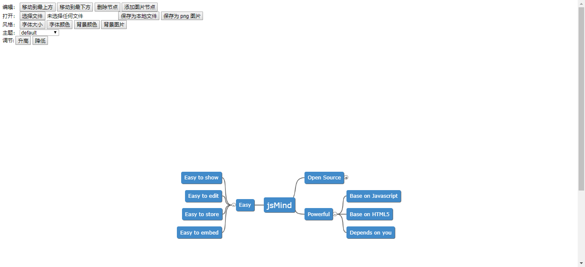

# vue-jsmind

> A Vue.js Component ( base on [jsmind](https://github.com/hizzgdev/jsmind ) )

English | [简体中文](README.zh-CN.md) 
# Install
```bash
yarn add vue-jsmind #or npm install vue-jsmind
```

# Quick Start
```js
import Vue from 'vue'
import jm from 'vue-jsmind'

Vue.use(jm)
```

# Use
```html
<js-mind :values="mind" :options="options" ref="jsMind" height="1000px"></js-mind>
```

## Props
- [values](https://github.com/hizzgdev/jsmind/blob/master/docs/en/1.usage.md#12-data-format)
- [options](https://github.com/hizzgdev/jsmind/blob/master/docs/zh/2.options.md)
- [ref](https://github.com/hizzgdev/jsmind/blob/master/docs/zh/3.operation.md#jsmind-%E5%AF%B9%E8%B1%A1) is mounted [jsmind API](https://github.com/hizzgdev/jsmind/blob/master/docs/zh/3.operation.md#jsmind-%E5%AF%B9%E8%B1%A1)


# Use Example
```bash
git clone git@github.com:chentoday/vue-jsmind.git
yarn #or npm install
yarn run dev #or npm run dev
```
## Result

